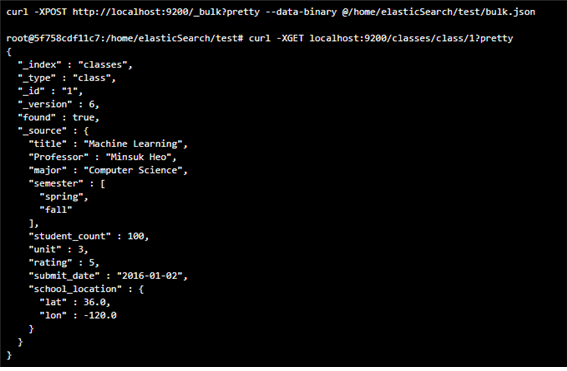
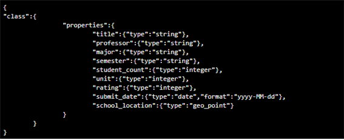
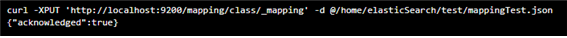
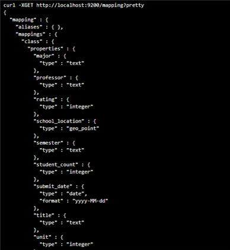
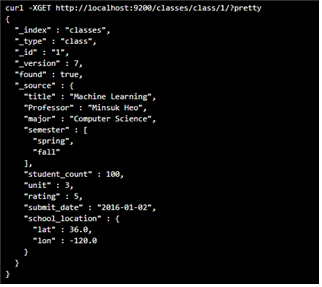

**엘라스틱서치 – 벌크(Bulk)**

벌크란 여러개의 document를 한번에 elastic search에 삽입하는 방법입니다.

bulk.json 파일을 elastic search에 삽입(POST)하고 조회(GET)하는 명령어와 결과입니다.

**엘라스틱서치 매핑(Mapping)**

매핑은 관계형데이터베이스에서 스키마 개념과 동일합니다.

데이터 매핑을 지정하는 방법은 아래와 같습니다.

**1) 먼저 매핑을 지정할 인덱스를 하나 생성합니다.**

**2) mappingTest.json 파일로 매핑을 지정합니다.**

- mappingTest.json 파일 내용입니다.

- 매핑 지정 명령어입니다.

- 매핑된 결과 출력입니다.

**3) bulk(json형태로 한번에 입력)을 사용하여 해당 인덱스에 데이터를 입력합니다.**

- 데이터가 들어갔는지 확인합니다.

