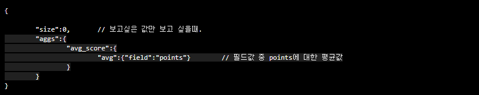
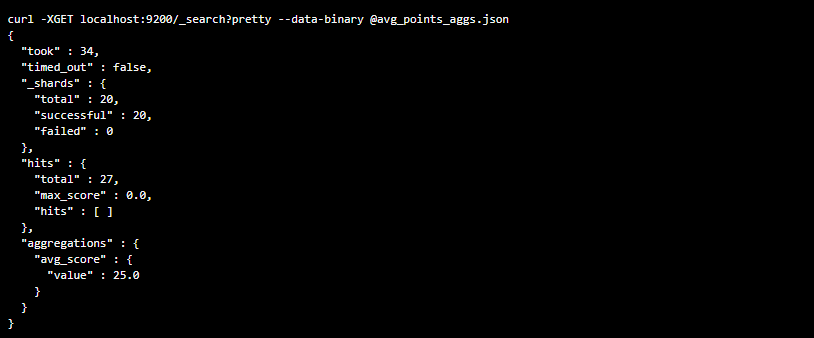
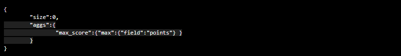
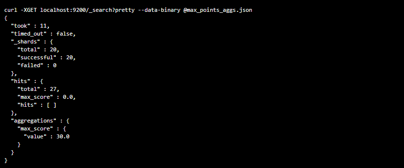
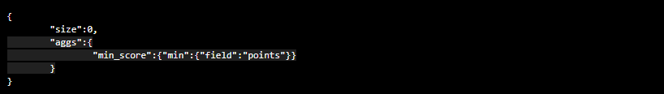
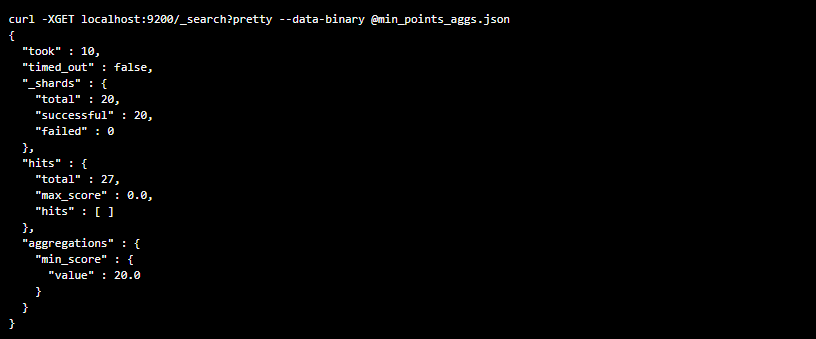
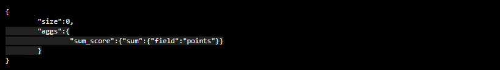
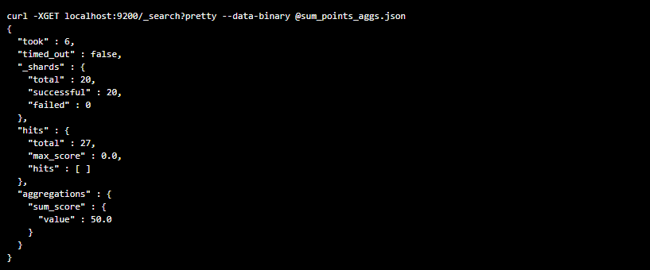
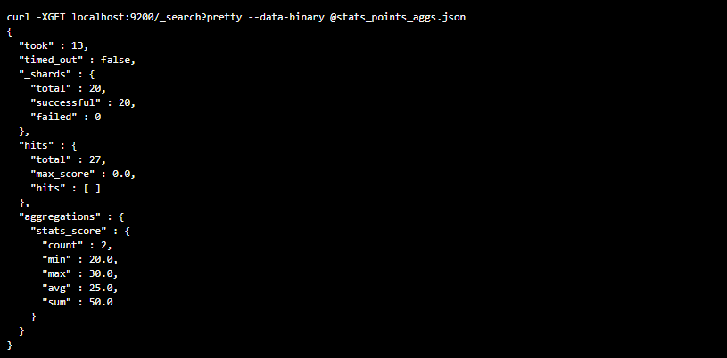

**Metric Aggregation이란?**

`Document 안에서 조합을 통해 특정(산술) 값을 도출할때 쓰이는 방법`

ex) 최대값, 최소값, 평균값 등을 구할때 사용합니다. 

샘플 데이터(points)는 30과 20으로 입력합니다.

**1. 평균값을 구하는 aggregation 파일(avg_points_aggs.json) 내용은 아래와 같습니다.**

제일 아래 aggregations의 avg_score의 value는 25.0로 평균값이 나왔습니다.

**2. 최대값을 구하는 aggregation 파일(max_points_aggs.json) 내용은 아래와 같습니다.**

제일 아래 aggregations의 max_score의 value는 30로 최대값이 나왔습니다.

**3. 최소값을 구하는 aggregation 파일(min_points_aggs.json) 내용은 아래와 같습니다.**

 
제일 아래 aggregations의 min_score의 value는 20.0로 최소값이 나왔습니다.

**4. 합계를 구하는 aggregation 설정 파일(sum_points_aggs.json) 입니다.**

제일 아래 aggregations의 sum_score의 value는 50.0로 합계값이 나왔습니다.

**5. 다음은 위에서 수행한 모든 계산값들을 한번에 구하는 파일(stats_points_aggs.json) 입니다.**

제일 아래 aggregations에 모든 결과가 한 번에 출력되는 것을 볼 수 있습니다.
