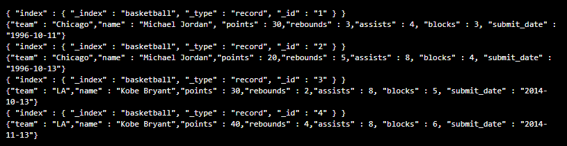
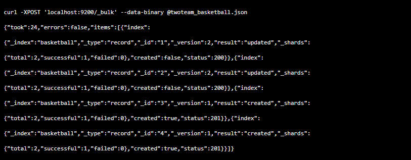
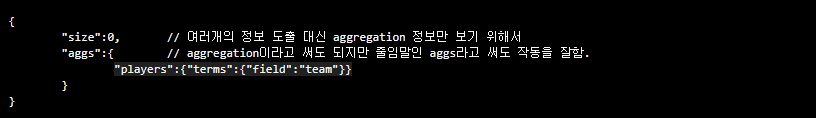
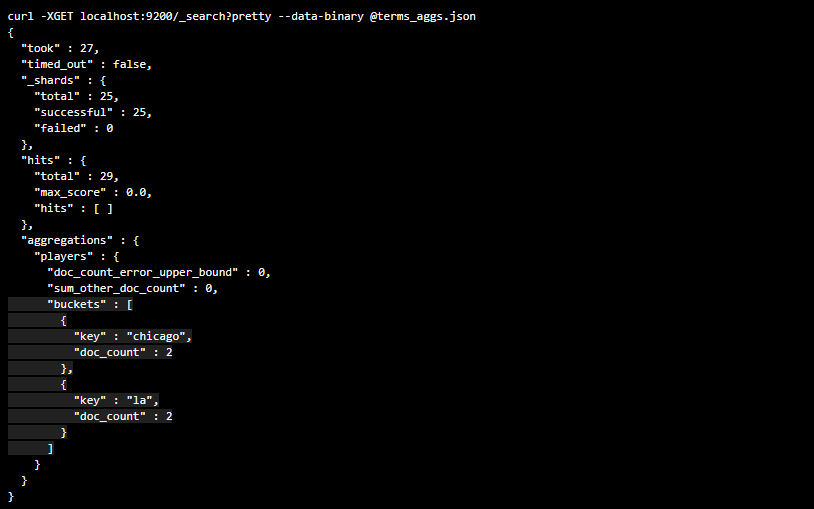
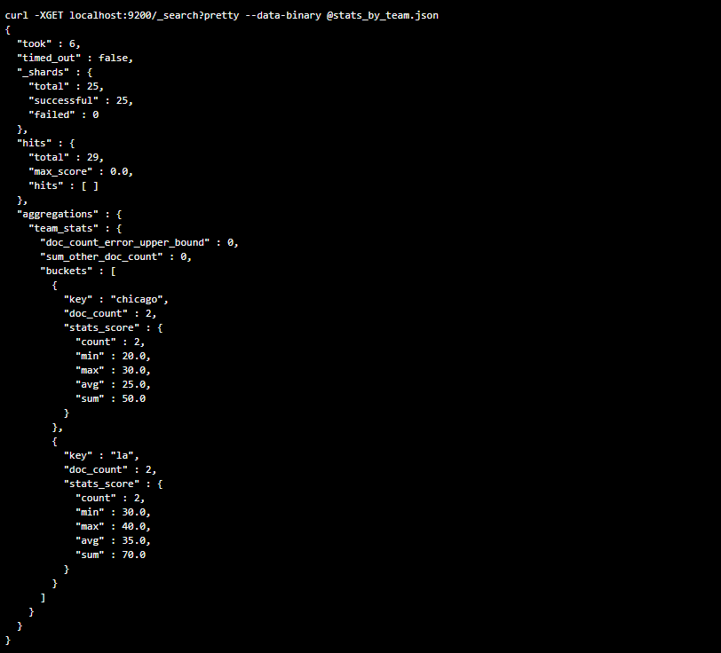

**Bucket Aggregation이란?**

`저번 포스팅에서 Metric Aggregation은 Document 안에서 산술 조합이였다면, 이번 Bucket Aggregation은 정렬(Group By)이라고 이해하면 되겠습니다.`  

## **1. 먼저 인덱스에 샘플 데이터를 삽입합니다.**

2개의 팀(Chicago, LA)에 대한 데이터 입니다.

모든 데이터가 successful:1로 정상적으로 데이터가 들어간 모습입니다.

## **2. 다음은 Bucket Aggregation을 하기위한, term aggregation.json 파일입니다. **

아래 파일은 플레이어의 팀 단위로 그룹을 생성하기 위함입니다.

term aggregation의 결과로 chicago는 Document 2개, la또한 Document 2개로 결과가 출력되었습니다.

여기서 팀을 분류하기에 끝이 아니라 팀별 성적을 구해보도록 하겠습니다.

## **3. 그룹으로 묶인 데이터를 간단하게 분석해보겠습니다.**

아래 파일은 팀별로 성적을 구하는 파일입니다.
팀별로 Document를 그룹으로 묶은 다음에 각 팀별로 통계(성적) 분석을 합니다.

플레이어의 팀 단위로 그룹(chicago, la)이 생성되었고, 해당 팀에 대한 count, min, max, avg, sum 결과값이 출력된것을 알수있습니다.

*여기까지는 기초적인 Elastic Search에 대해서 알아보았고, 다음 포스팅 부터는 Kibana에 대해서 포스팅으로 뵙겠습니다.*

